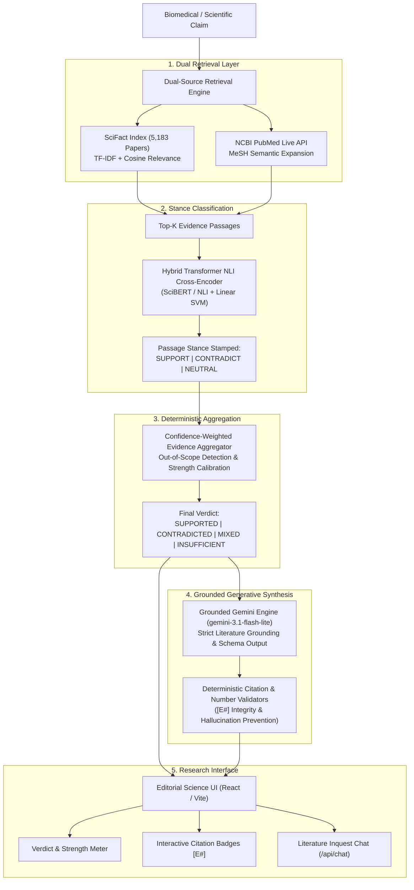

# VeriSci: Automated Biomedical Evidence Verification & Literature Synthesis

[](https://python.org)
[](https://fastapi.tiangolo.com)
[](https://reactjs.org)
[](https://vitejs.dev)
[](https://tailwindcss.com)
[](https://ai.google.dev)
[](https://pytest.org)

> **VeriSci** is an end-to-end scientific truth verification engine designed to cross-reference biomedical and health claims against peer-reviewed scientific literature. By combining **dual-stage corpus retrieval (SciFact + Live PubMed)**, **Transformer-based Natural Language Inference (NLI)**, and **grounded generative AI synthesis via Google Gemini**, VeriSci produces calibrated verdicts (`SUPPORTED`, `CONTRADICTED`, `MIXED`, `INSUFFICIENT`) with exact citations and interactive inquest capabilities.

---

## System Architecture



---

## Core Features & Capabilities

### 1. Dual-Source Retrieval Engine
- **SciFact Corpus**: Indexes **5,183 peer-reviewed biomedical abstracts** with BM25/TF-IDF vector matching.
- **PubMed Live Integration**: Expands queries with Medical Subject Headings (MeSH) and queries NCBI PubMed via live REST API for latest publications.
- **Out-of-Scope Guardrails**: Automatically detects non-biomedical claims (e.g. general trivia, astrology) and flags them before classification.

### 2. Transformer NLI Stance Classification
- **Cross-Encoder Architecture**: Evaluates paired `(claim, evidence_passage)` inputs.
- **Three-Way Stance**: Categorizes each retrieved passage as `SUPPORT`, `CONTRADICT`, or `NEUTRAL`.
- **Calibrated Confidence**: Outputs statistical probability scores for each passage.

### 3. Transparent Verdict Aggregation
- Combines stance counts, relevance rankings, and classification confidence scores into an overall claim verdict:
  - `SUPPORTED`: Clear empirical consensus across studies.
  - `CONTRADICTED`: Peer-reviewed evidence refutes the hypothesis.
  - `MIXED`: Genuine scientific debate or conflicting study outcomes.
  - `INSUFFICIENT`: Low relevance scores or no pertinent literature identified.

### 4. Zero-Hallucination Grounded Gemini RAG
- **Strict Evidence Grounding**: Powered by Google Gemini (`gemini-3.1-flash-lite`, with fallback cascade to `gemini-3.8-flash`, `gemini-3.5-flash`, and `gemma-4-26b-a4b-it`).
- **Citation Badges (`[E1]`, `[E2]`)**: Every factual assertion is tied directly to retrieved passage IDs.
- **Hallucination Prevention**: Automated server-side validators check numerical assertions, citation validity, and verdict consistency.
- **Analytical Caveats**: Highlights limitations such as small sample sizes, in-vitro models, or observational study constraints.

### 5. Conversational Literature Inquest
- Allows researchers and clinicians to query the retrieved dossier interactively via `/api/chat`.
- Returns strictly grounded answers with exact study references.

### 6. Natural Editorial UI
- Atmospheric cellular microscopy background canvas with layered CSS masking.
- Scholarly typography combining **Newsreader** serif and **Plus Jakarta Sans**.
- Interactive stance filtering, smooth citation jumping, and tactile glassmorphic cards.

---

## Repository Structure

```
VeriSci/
├── backend/
│   ├── aggregation.py             # Verdict & confidence score aggregator
│   ├── config.py                  # Environment & model settings
│   ├── main.py                    # FastAPI server & route handlers
│   ├── requirements.txt           # Python dependencies
│   ├── ml/
│   │   ├── inference.py           # NLI classification inference pipeline
│   │   └── train.py               # Model training & weights
│   ├── rag/
│   │   ├── context.py             # Context assembler for LLM prompts
│   │   ├── llm.py                 # Gemini client with multi-model fallback
│   │   ├── prompts.py             # System & inquest prompt templates
│   │   ├── service.py             # /api/explain & /api/chat orchestration
│   │   └── validators.py          # Strict citation, number & verdict validators
│   ├── retrieval/
│   │   ├── build_index.py         # SciFact index builder
│   │   ├── pubmed.py              # Live NCBI PubMed API integration
│   │   └── retrieve.py            # Dual retrieval coordinator
│   └── tests/
│       ├── test_aggregation.py    # Aggregation logic test suite
│       ├── test_api.py            # FastAPI endpoint tests
│       └── test_rag.py            # RAG validators & synthesis tests
├── frontend/
│   ├── public/
│   │   └── scientific_bg.jpg      # High-res cellular microscopy asset
│   ├── src/
│   │   ├── App.jsx                # Root app & background canvas layer
│   │   ├── index.css              # Editorial styles, canvas masking & tokens
│   │   ├── components/
│   │   │   ├── ClaimChat.jsx      # Literature inquest chat widget
│   │   │   ├── ClaimInput.jsx     # Claim search input console
│   │   │   ├── EvidenceCard.jsx   # Scientific paper dossier card
│   │   │   ├── ExampleClaims.jsx  # Curated benchmark claim pills
│   │   │   ├── ExplanationCard.jsx# AI synthesis & caveats card
│   │   │   ├── Navbar.jsx         # Header navigation bar
│   │   │   ├── VerdictCard.jsx    # Authoritative verdict display
│   │   │   └── Footer.jsx         # Research provenance footer
│   │   └── pages/
│   │       ├── Home.jsx           # Landing & claim input page
│   │       ├── Analysis.jsx       # Real-time scan progression page
│   │       └── Results.jsx        # Verification dossier dashboard
│   ├── package.json               # Node dependencies & scripts
│   └── vite.config.js             # Vite configuration with Tailwind CSS v4
├── docs/                          # Technical phase design specifications
├── .env.example                   # Environment configuration template
└── README.md                      # Project documentation
```

---

## Getting Started

### Prerequisites
- **Python 3.11+**
- **Node.js 18+** & **npm**
- *(Optional)* **Google Gemini API Key** (for generative explanations; defaults to graceful deterministic templates if omitted)

---

### Backend Setup

1. **Navigate to the backend directory and set up a virtual environment**:
   ```bash
   cd backend
   python -m venv .venv
   
   # Windows:
   .venv\Scripts\activate
   # macOS/Linux:
   source .venv/bin/activate
   ```

2. **Install dependencies**:
   ```bash
   pip install -r requirements.txt
   ```

3. **Configure Environment Variables**:
   Copy `.env.example` to `.env` in the project root:
   ```bash
   cp .env.example .env
   ```
   Edit `.env`:
   ```env
   # Provide your Google AI Studio API key
   GEMINI_API_KEY=your_api_key_here

   # Primary LLM Model (fallback models are automatically handled)
   LLM_MODEL=gemini-3.1-flash-lite

   # LLM Provider ('gemini' or 'mock')
   LLM_PROVIDER=gemini
   ```

4. **Start the FastAPI server**:
   ```bash
   python -m uvicorn backend.main:app --reload --host 127.0.0.1 --port 8000
   ```
   The backend API documentation is available at `http://127.0.0.1:8000/docs`.

---

### Frontend Setup

1. **Navigate to the frontend directory**:
   ```bash
   cd frontend
   ```

2. **Install npm dependencies**:
   ```bash
   npm install
   ```

3. **Run the Vite development server**:
   ```bash
   npm run dev
   ```

4. **Access the application**:
   Open **[http://localhost:5173](http://localhost:5173)** in your browser.

---

## API Reference

### 1. `POST /api/verify`
Performs end-to-end evidence retrieval, NLI classification, and verdict aggregation.

**Request:**
```json
{
  "claim": "Regular vitamin C supplementation reduces the duration of common cold episodes.",
  "top_k": 5
}
```

**Response:**
```json
{
  "verification_id": "8f3b2a1c-...",
  "claim": "Regular vitamin C supplementation reduces the duration of common cold episodes.",
  "verdict": "SUPPORTED",
  "strength": "STRONG",
  "score": 0.88,
  "reason": "Multiple randomized trials corroborate regular vitamin C supplementation modestly shortens cold duration.",
  "counts": { "support": 3, "contradict": 0, "neutral": 1, "papers": 3 },
  "evidence": [
    {
      "evidence_id": "E1",
      "source": "PubMed",
      "title": "Vitamin C for preventing and treating the common cold",
      "evidence_text": "Twenty-nine trial comparisons involving 11,306 participants contributed to the meta-analysis on duration...",
      "relevance_score": 0.94,
      "prediction": "SUPPORT",
      "confidence": 0.91,
      "url": "https://pubmed.ncbi.nlm.nih.gov/23440782/"
    }
  ]
}
```

---

### 2. `POST /api/explain`
Generates grounded Gemini natural language synthesis with exact citation badges.

**Request:**
```json
{
  "verification_id": "8f3b2a1c-..."
}
```

**Response:**
```json
{
  "explanation": "The retrieved evidence indicates that regular vitamin C supplementation modestly reduces cold duration in adults (8%) and children (14%) [E1]. The system reached a SUPPORTED verdict because randomized trials consistently show shortened symptom duration [E1, E2].",
  "citations": ["E1", "E2"],
  "limitations": [
    "Evidence focuses on continuous daily prophylaxis rather than post-onset treatment.",
    "The overall reduction magnitude is modest."
  ]
}
```

---

### 3. `POST /api/chat`
Allows conversational inquest into the retrieved literature context.

**Request:**
```json
{
  "verification_id": "8f3b2a1c-...",
  "message": "What percentage reduction was seen in children vs adults?",
  "history": []
}
```

**Response:**
```json
{
  "answer": "In children, regular vitamin C supplementation resulted in a 14% reduction in cold duration, compared to an 8% reduction in adults [E1].",
  "citations": [
    { "evidence_id": "E1", "title": "Vitamin C for preventing and treating the common cold", "source": "PubMed" }
  ],
  "answerable": true
}
```

---

## Testing & Quality Assurance

Run the automated backend test suite:
```bash
pytest backend/tests -v
```

**Test Coverage Summary:**
- `test_aggregation.py`: Stance distribution weighting, empty edge cases, and mixed confidence scenarios.
- `test_api.py`: Health checks, live query retrieval, out-of-scope claim detection, verify pipeline, and classify routes.
- `test_rag.py`: Citation parsing, numerical fabrication checks, verdict consistency, and context formatting.

Validate frontend production bundle:
```bash
cd frontend && npm run build
```

---

## Benchmark Datasets & Citations

- **SciFact Dataset**: [Allen Institute for AI (Wadden et al., EMNLP 2020)](https://github.com/allenai/scifact) - *Fact-Checking Scientific Claims with Evidence*.
- **PubMed REST APIs**: National Center for Biotechnology Information (NCBI) Entrez E-utilities.
- **Google Generative AI**: [Google AI Studio & Gemini API](https://ai.google.dev).

---

## License

This project is licensed under the [MIT License](LICENSE). Built for academic, research, and scientific literature verification.
